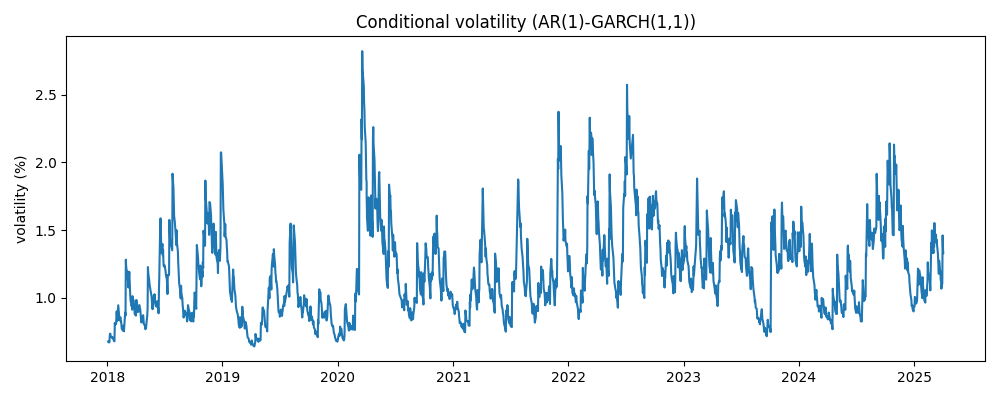

# Commodity Hedging

## Overview

This project focuses on developing, analyzing, and backtesting **Hedging** strategies for **Brent Crude Oil** using daily pricing data.

---

## Features
  
- **Return & Volatility Modeling** using AR-GARCH model
    
- **Hedge Ratio Estimation** with various approaches 
  - Naive Hedge (1-to-1 ratio)
  - Static OLS Hedge Ratio
  - Dynamic Hedge Ratio

- **Hedging Performance Analysis** in terms of hedging effectiveness metric, Sharpe ratio, drawdowns

---

## Model Diagnostics

Ttested for ARCH effects in Brent crude returns to verify volatility clustering.

**Engle’s ARCH LM Test Result :**
  - LM Statistic: ~ 121.93 
  - p-value: 2.55 × 10⁻²⁰ ~ 0 

Since p-value << 0.05, we can reject Null Hypothesis, strongly confiring the presence of volatility clustering in Brent crude returns.

**AR(1)-GARCH(1,1) Model**
  - omega: 0.0486  
  - alpha: 0.1162  
  - beta 0.8587  
  - persistence = alpha + beta = 0.9749  

The high persistence value (~ 1) indicates that shocks to volatility decay slowly, consistent with volatility clustering observed in financial time series.

The figure below shows the conditional volatility estimated by the GARCH(1,1) model.

